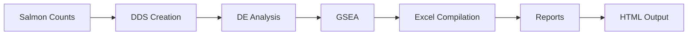

# Yildiz Lab RNA-seq Analysis Pipeline

**Author:** Giordan Kitts
**Lab:** Yildiz Lab
**Version:** 2.0.0

---

## Overview

This repository contains an automated RNA-seq analysis pipeline for differential expression analysis of *Vibrio cholerae* samples in the Yildiz Lab. The pipeline combines DESeq2-based analysis with automated report generation, organized output management, and batch processing capabilities.

### Key Features
- **Modular Pipeline**: Separate DDS creation, differential expression analysis, and report generation steps
- **Automated Reports**: Publication-quality HTML reports with interactive visualizations
- **Batch Processing**: Run multiple experiments with a single command
- **Professional Output**: Organized directory structure with Excel compilations and GSEA results
- **Flexible Configuration**: Global settings with experiment-specific overrides

---

## Quick Start

### Run Single Experiment
```bash
# Full pipeline (DDS + Analysis + Reports)
Rscript run_experiment.R experiment_name

# Individual steps
Rscript run_experiment.R experiment_name --dds-only
Rscript run_experiment.R experiment_name --analysis-only
Rscript run_experiment.R experiment_name --reports-only
```

### Batch Processing
```bash
# Check status of all experiments
Rscript run_all.R --status

# Run full pipeline on all experiments
Rscript run_all.R

# Run specific experiments
Rscript run_all.R -e experiment1,experiment2
```

### Create New Experiment
```bash
Rscript new_experiment_setup.R new_experiment_name
```

This creates a new experiment folder with:
- Customized `analysis_script.R` template
- Organized output directory structure
- Ready-to-edit filtering logic and contrast definitions

---

## Directory Structure

```
gk-rnaseq-analyzer/
├── config/
│   └── global_settings.yaml          # Global paths and settings
├── functions/
│   ├── dds_management.R               # DESeq2 object creation
│   ├── differential_expression.R     # DE analysis and GSEA
│   ├── de_compilation.R               # Result compilation
│   ├── output_management.R           # File organization
│   ├── report_generation.R           # Automated reports
│   └── run_utils.R                   # Pipeline execution
├── experiments/
│   ├── TEMPLATE/                     # Template for new experiments
│   └── experiment_name/              # Individual experiments
│       ├── analysis_script.R         # Custom filtering and contrasts
│       └── outputs/                  # Generated outputs (gitignored)
├── shared_resources/
│   ├── annotations/                  # Genome annotations, gene sets
│   └── metadata/                     # Master sample metadata
├── templates/
│   └── reports/                      # Quarto report templates
├── run_experiment.R                  # Single experiment runner
├── run_all.R                        # Batch processing script
└── new_experiment_setup.R            # New experiment setup
```

### Experiment Output Structure

Each experiment generates organized outputs in `experiments/experiment_name/outputs/`:

```
outputs/
├── overview.html                     # Main landing page
├── experiment_DEcompilation.xlsx     # Primary results file
├── data_tables/                      # CSV exports and GSEA results
│   ├── individual_comparisons/       # Per-comparison CSV files
│   ├── experiment_GSEA_GObp.xlsx    # GSEA biological process
│   └── experiment_GSEA_GOmf.xlsx    # GSEA molecular function
├── reports/                          # Generated reports
│   └── html/                        # Self-contained HTML reports
└── technical/                        # Technical files
    ├── R/                           # RDS objects (.dds, _data.RDS)
    ├── metadata/                    # YAML files, sample info
    └── logs/                        # Processing logs
```

---

## Pipeline Architecture

### Core Components

**1. Data Management** (`functions/dds_management.R`)
- Creates DESeq2 objects from salmon quantification
- Filters low-count transcripts with reporting
- Saves comprehensive metadata

**2. Differential Expression** (`functions/differential_expression.R`)
- Generates shrunken log2FC results using DESeq2
- Creates standard result subsets (all, significant, DE)
- Runs GSEA analysis with fgsea

**3. Result Compilation** (`functions/de_compilation.R`)
- Compiles results across multiple comparisons
- Creates master tables with normalized counts
- Adds pathway annotations and README sheets

**4. Output Management** (`functions/output_management.R`)
- Ensures consistent directory structure
- Generates professionally formatted Excel files
- Manages GSEA output files

**5. Report Generation** (`functions/report_generation.R`)
- Compiles comprehensive data packages
- Generates HTML/PDF reports using Quarto templates
- Creates interactive visualizations

**6. Pipeline Execution** (`functions/run_utils.R`)
- Manages experiment validation and status checking
- Handles command-line argument parsing
- Provides batch processing utilities

### Pipeline Workflow



**Key Steps:**
1. **DDS Generation**: Import salmon counts, filter low-count genes, create DESeq2 dataset
2. **DE Analysis**: Run differential expression with LFC shrinkage for each contrast
3. **GSEA Analysis**: Pathway enrichment using GO gene sets
4. **Compilation**: Merge results, add annotations, create Excel files
5. **Reports**: Generate interactive HTML reports with visualizations

---

## Configuration

### Global Settings (`config/global_settings.yaml`)

```yaml
paths:
  metadata_file: shared_resources/metadata/rnaseq_yildiz_metadata.xlsx
  salmon_base: shared_resources/rnaseq_counts
  annotation_db: shared_resources/annotations/vc_genome_anno.RDS
  genesets: shared_resources/annotations/vc_genesets.GO.RDS

analysis:
  significance_threshold: 0.05
  log2FC_threshold: 1.0
  min_counts: 2.0
  lfcShrinkage_method: "ashr"
```

### Experiment Setup

Each experiment has a custom `analysis_script.R` with:

**1. Sample Filtering Logic**
```r
coldata <- coldata.in %>%
  filter(experiment_group %in% c("your_group")) %>%
  mutate(
    strain = fct_relevel(strain, "WT"),
    condition = fct_relevel(condition, "control")
  )
```

**2. Contrast Definitions**
```r
contrast_list <- list(
  c("group", "treatment", "control"),
  c("group", "mutant", "WT")
)
```

---

## Usage Examples

### Standard Analysis Workflow

1. **Setup**: Create new experiment
   ```bash
   Rscript new_experiment_setup.R iron_study
   ```

2. **Configure**: Edit `experiments/iron_study/analysis_script.R`
   - Customize sample filtering logic
   - Define contrasts for comparisons

3. **Execute**: Run full pipeline
   ```bash
   Rscript run_experiment.R iron_study
   ```

4. **Review**: Check outputs
   - Main overview: `experiments/iron_study/outputs/overview.html`
   - Excel compilation: `experiments/iron_study/outputs/iron_study_DEcompilation.xlsx`
   - Reports: `experiments/iron_study/outputs/reports/html/`

### Iterative Development

```bash
# Initial run (slow step)
Rscript run_experiment.R experiment --dds-only

# Refine contrasts, rerun analysis
Rscript run_experiment.R experiment --analysis-only

# Update report templates, regenerate
Rscript run_experiment.R experiment --reports-only
```

### Batch Processing

```bash
# Check status
Rscript run_all.R --status
# Example output:
# LG_pmB: DDS ✓ | Analysis ✓ | Reports ✓
# rsRDM_all: DDS ✓ | Analysis ✓ | Reports ✓

# Selective updates
Rscript run_all.R --reports-only

# Force regeneration
Rscript run_all.R --force
```

---

## Generated Reports

### 1. Overview Page (`overview.html`)
- Main landing page with experiment summary
- Links to all generated reports
- Sample counts and analysis statistics

### 2. Interactive Heatmap
- Smart gene selection (DE genes + lab pathways + high-variance)
- Interactive zoom, pan, hover tooltips
- Hierarchical clustering with sample annotations

### 3. Experimental Summary
- Sample information and library sizes
- PCA analysis
- DE statistics across comparisons
- Sample distance heatmap

### 4. Comparison Reports
- Individual differential expression results
- Volcano plots and MA plots
- Top gene tables with annotations
- Expression heatmaps
- GSEA pathway enrichment

### 5. Excel Compilations
- **DE Compilation**: Multi-sheet workbook with all comparisons
- **GSEA Results**: Separate files for GO biological process and molecular function
- Professional formatting with frozen panes and autofilters

---

## Key Features

### Data Organization
- **Self-Contained Experiments**: Each experiment has its own organized folder
- **Consistent Structure**: Automated directory creation with standard layout
- **Technical Files**: RDS objects and metadata in `technical/` subdirectory

### Analysis Features
- **LFC Shrinkage**: Uses `ashr` method for accurate effect size estimation
- **GSEA Analysis**: Pathway enrichment with GO gene sets
- **Pathway Subsets**: Custom Yildiz lab gene set annotations
- **Quality Control**: Filtering reports and diagnostic plots

### Output Features
- **Excel Formatting**: Professional styling with optimized column widths
- **Normalized Counts**: Included in master compilation tables
- **README Sheets**: Analysis metadata in Excel files
- **CSV Exports**: Individual comparisons for downstream analysis

---

## Software Dependencies

### Required R Packages

**CRAN:**
- tidyverse, yaml, glue, fs
- ggplot2, ggrepel, patchwork
- openxlsx, readxl, writexl
- optparse (for command-line interface)

**Bioconductor:**
- DESeq2, tximeta
- fgsea (for GSEA analysis)

### Installation

```r
# Install CRAN packages
install.packages(c("tidyverse", "yaml", "glue", "fs",
                   "ggrepel", "patchwork", "openxlsx", "readxl", "optparse"))

# Install Bioconductor packages
if (!require("BiocManager", quietly = TRUE))
    install.packages("BiocManager")
BiocManager::install(c("DESeq2", "tximeta", "fgsea"))
```

---

## Technical Notes

### Path Management
- All functions use `here()` for consistent path resolution
- Works correctly regardless of execution directory
- Supports symlinks and complex directory structures

### Error Handling
- Graceful template failure handling
- Comprehensive input validation
- Informative error messages with suggested fixes

### Performance
- Expensive DDS creation only when needed
- Selective regeneration based on file timestamps
- Efficient memory usage for large datasets

---

## Troubleshooting

### Common Issues

**"DDS not found"**
- Run with `--dds-only` first to generate DESeq2 object

**"Missing files"**
- Check paths in `config/global_settings.yaml`
- Verify salmon quantification files exist

**Template failures**
- Non-critical, core pipeline continues
- Check Quarto installation for report generation

### Debug Commands

```bash
# Check experiment structure
ls -la experiments/experiment_name/outputs/

# Verify technical files
ls -la experiments/experiment_name/outputs/technical/R/

# Check status
Rscript run_experiment.R experiment_name --status
```

---

## Citation and License

### Citation
If you use this pipeline, please cite:
- **DESeq2**: Love, M.I., Huber, W., Anders, S. (2014) Genome Biology
- **fgsea**: Korotkevich, G. et al. (2021) bioRxiv

### License
This project is licensed under the GNU General Public License v3.0. See LICENSE file for details.

**Author:** Giordan Kitts
**Lab:** Yildiz Lab
**Contact:** [Contact information]

---

*Last updated: 2025-10-02*
